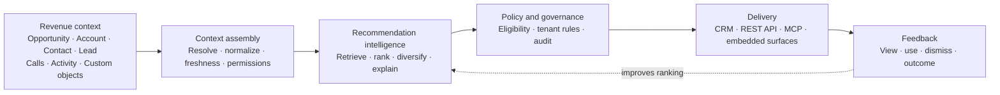
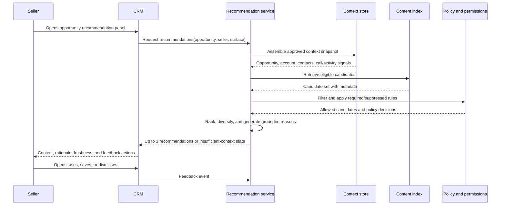
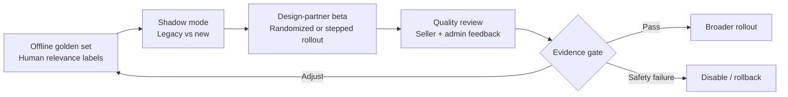

# Rebuilding Mindtickle's Content Recommendation Engine

## Strategy, roadmap, product requirements, and rollout approach

**Group Product Manager — Platform Interview Assignment**  
**Document for discussion**  
**Author:** Siddharth Jaiswal  
**Date:** June 2026

---

## Executive summary

Mindtickle's current recommendation engine solves a useful but narrow problem: rules match opportunity attributes in CRM to content. The next version should preserve the control and predictability customers value while removing three constraints: one context, one surface, and static relevance.

My recommendation is to build a **Contextual Content Recommendation Platform**: a tenant-safe service that assembles context from revenue objects and interaction signals, retrieves and ranks eligible content, explains why each item was recommended, and delivers the result through CRM experiences, APIs, and MCP tools.

The strategy is deliberately sequenced:

1. **Prove relevance before platform breadth.** Rebuild the existing opportunity use case on shared recommendation infrastructure and demonstrate parity in shadow mode.
2. **Expand context where it changes the decision.** Add account, contact, lead, call-history, activity, and custom-object signals behind one flagship workflow.
3. **Open the service after the contract is stable.** Expose versioned APIs and MCP tools using the same authorization, policy, explanation, and feedback controls as Mindtickle-owned experiences.
4. **Learn with guardrails.** Use explicit and behavioral feedback to improve ranking while retaining deterministic policy, eligibility, permissions, and administrative overrides.

The initial product initiative is **Multi-context Content Recommendations for Opportunity Preparation**. It gives a seller a short, explained set of content recommendations based on the opportunity, related account and contacts, recent calls and activity, and the seller's permissions. It is a bounded use case that validates the most important platform assumptions without requiring the entire future platform upfront.

The proposed roadmap spans four horizons over approximately 12–18 months. Progression between horizons is based on evidence—not calendar completion alone. The first funding decision is a six-month foundation and validation effort, with explicit quality, adoption, reliability, and safety gates.

---

## 1. Starting point and strategic diagnosis

### What exists today

Based on the assignment brief, the current engine:

- is rule-based;
- operates in the context of a CRM opportunity;
- uses opportunity attributes such as sales stage and industry;
- recommends content inside the CRM experience.

This design has strengths worth retaining. Rules are predictable, fast, administratively controllable, and easy to inspect. The problem is not that rules exist; it is that rules carry too much responsibility.

### Structural constraints

| Constraint | Customer impact | Strategic implication |
|---|---|---|
| Opportunity attributes are the primary context | Recommendations miss call intent, buyer engagement, account history, persona, and custom signals | Context assembly must become a reusable platform capability |
| Rules determine relevance | Administrators must anticipate and maintain every useful combination | Rules should govern eligibility and policy; ranking should handle relevance |
| CRM is the primary surface | Recommendations cannot consistently serve other CRMs, partner workflows, APIs, or agents | Delivery must be decoupled from recommendation generation |
| Feedback does not systematically improve ranking | Relevance cannot compound from use and outcomes | Every recommendation needs an observable lifecycle |
| Content is returned without sufficient evidence | Sellers and administrators may not understand or trust the result | Explanations, provenance, and confidence must be part of the response contract |

### Strategic question

The question is not simply, “How do we replace rules with AI?” It is:

> How can Mindtickle turn heterogeneous revenue context into trusted content recommendations on any authorized surface, while preserving enterprise control?

This framing avoids two weak extremes: rebuilding the same engine with an LLM, or attempting a broad autonomous revenue platform before proving customer value.

### Assumptions to validate

The brief does not provide customer research or baseline product data. The following are hypotheses, not asserted facts:

- More context will improve recommendation usefulness enough to justify added complexity.
- Sellers will act more often when recommendations are timely, concise, and explained.
- Enterprise customers will value API/MCP access once the core service is reliable and governed.
- Existing rules can be migrated into eligibility and policy controls without losing critical customer behavior.
- Recommendation acceptance is a useful leading signal, but downstream revenue attribution will require controlled analysis and longer observation windows.

The first two roadmap horizons are designed to test these assumptions.

---

## 2. Product vision and strategic choices

### Vision

**For any authorized revenue context, return the most useful approved content, explain why it fits, and make it available wherever the customer works.**

### Target product model



### Five strategic choices

#### 1. Content first; extensible by design

The assignment is about content recommendations. The initial platform should therefore optimize for content rather than immediately generalizing to coaching, learning, roleplay, or autonomous next-best actions. Shared contracts can support those future types, but they are not Phase 1 requirements.

#### 2. Hybrid intelligence, not “AI instead of rules”

- Rules and policies determine what is allowed, required, suppressed, or overridden.
- Retrieval finds potentially relevant approved content.
- Ranking orders candidates using structured features, semantic relevance, freshness, and feedback.
- Generative AI may summarize rationale, but it should not invent content or override eligibility.

This separation retains administrator control while reducing manual rule proliferation.

#### 3. One service contract across surfaces

Mindtickle-owned CRM experiences, public APIs, and MCP tools should call the same recommendation service. Authorization and response semantics remain consistent; only presentation changes by surface.

#### 4. Explanation is product functionality

Each surfaced recommendation should include:

- the content and intended use;
- two or three reason codes grounded in current context;
- source and freshness of supporting signals;
- confidence or a clear “insufficient context” state;
- a feedback action.

The system should return no recommendation when it cannot produce an eligible, defensible result.

#### 5. Evidence gates roadmap expansion

The platform opens progressively. Multi-context expansion depends on relevance lift. External APIs depend on contract and reliability maturity. MCP depends on demonstrated customer or partner workflows, not protocol enthusiasm alone.

### What this strategy does not do

- Replace CRM as the system of record.
- Train on one tenant's data for another tenant without explicit permission and contractual controls.
- Generate new sales content as part of the initial recommendation workflow.
- Automate seller actions in the initial roadmap.
- Require a graph database before data shape and query patterns prove the need.
- Expose internal reasoning traces. Explanations cite inputs and reason codes, not hidden chain-of-thought.

---

## 3. Experience principles

1. **Useful over abundant.** Return a small ranked set, with a default maximum of three recommendations.
2. **Contextual over generic.** Show why the recommendation fits this customer, buyer, moment, and seller.
3. **Permission-safe by construction.** Filter inaccessible or ineligible content before ranking and explanation.
4. **Fresh or absent.** Suppress time-sensitive results when context or content is stale.
5. **Controllable by administrators.** Customers configure eligible libraries, required content, suppression rules, and source precedence.
6. **Consistent across surfaces.** Recommendation identity, rationale, policy, and feedback behavior do not change between CRM, API, and MCP.
7. **Measurable end to end.** Observe generation, delivery, view, use, dismiss, and downstream outcome without equating correlation with causation.

---

## 4. High-level strategic roadmap

The timing below is directional. Each horizon has an evidence gate that determines whether to expand, adjust, or stop.

| Horizon | Objective | Customer scope | Core deliverables | Evidence gate |
|---|---|---|---|---|
| **0. Baseline and design partners** 0–6 weeks | Establish facts before rebuilding | Internal teams and 3–5 representative customers | Current-engine baseline; rule inventory; content taxonomy audit; privacy/security review; design-partner workflows; offline evaluation set | Baseline coverage is sufficient to compare old and new systems; flagship workflow and target segment agreed |
| **1. Foundation and parity** 2–6 months | Re-platform the current opportunity use case safely | Shadow mode, then limited beta | Shared recommendation service; opportunity context adapter; hybrid retrieval/ranking; policy and permissions; explanations; feedback events; observability; legacy fallback | At least parity with legacy on blinded expert judgment; no critical permission leakage; latency/reliability targets met; rollback proven |
| **2. Multi-context value** 6–10 months | Prove that added context improves seller decisions | Design partners in one flagship workflow | Account/contact context; recent call and activity signals; custom field mapping; context freshness; seller-facing feedback; admin diagnostics | Statistically and practically meaningful lift in recommendation usefulness versus opportunity-only control; acceptable noise and opt-out rates |
| **3. Open delivery platform** 9–14 months | Let customers and partners consume the capability safely | Selected developers and partners | Versioned REST API; events/webhooks; SDK patterns; sandbox; quotas; developer documentation; MCP tools mapped to proven workflows | External consumers reach production; API SLOs met; support burden and security posture acceptable |
| **4. Scale and adjacent recommendations** 12–18 months | Expand where shared infrastructure creates leverage | Broader enterprise availability | Self-serve connector/configuration improvements; outcome-aware ranking; additional recommendation types selected from evidence; partner ecosystem | Demonstrated customer demand, unit economics, and reuse of core platform capabilities |

### Why this sequence

- It isolates migration risk before adding new context.
- It tests whether context produces measurable relevance lift before investing in every connector.
- It stabilizes the internal contract before external developers depend on it.
- It keeps optionality for future recommendation types without placing them on the critical path.

### Build, partner, and defer

| Decision | Approach | Rationale |
|---|---|---|
| Recommendation orchestration, policy, feedback, and evaluation | **Build** | These encode product behavior, enterprise trust, and learning loops |
| CRM and Mindtickle context adapters | **Build selectively** | Core to the starting workflow and data quality |
| Model and embedding providers | **Partner / abstract** | Models will change; differentiation is not model hosting |
| Generic connector breadth | **Partner after core workflows stabilize** | Avoid funding long-tail integration work before demand is known |
| Autonomous actions | **Defer** | Outside the assignment's initial content-recommendation value proposition and higher risk |

---

# Part II — Product Requirements Document

## 5. Initiative: Multi-context Content Recommendations for Opportunity Preparation

### 5.1 PRD metadata

| Field | Value |
|---|---|
| **Status** | Proposed for discovery and design-partner validation |
| **Roadmap horizon** | Horizon 2, built on Horizon 1 foundations |
| **Primary user** | Account executive preparing for or advancing an opportunity |
| **Secondary users** | Sales manager, enablement administrator, RevOps/platform administrator |
| **Initial surfaces** | Existing CRM experience and internal recommendation API |
| **Initial context** | Opportunity, account, contacts, approved custom fields, recent call summary/signals, recent activity |
| **Recommendation type** | Existing approved content only |

### 5.2 Problem

A recommendation based only on opportunity attributes can miss the immediate selling context. Two opportunities at the same stage and in the same industry may require different content because the buyer personas, recent objections, engagement pattern, account history, or approved customer-specific fields differ.

Sellers need a short, trusted answer to: **“What approved content is most useful for this opportunity now, and why?”** Enablement and platform administrators need control over what may be recommended and visibility into how the system reached that result.

### 5.3 Goal

Increase the usefulness and use of approved content recommendations for opportunity preparation by incorporating relevant, fresh, permission-safe context beyond opportunity fields.

### 5.4 Success criteria

Targets must be finalized after Horizon 0 establishes baselines. Proposed decision criteria are:

| Dimension | Metric | Proposed gate |
|---|---|---|
| **Recommendation quality** | Blinded expert preference: multi-context versus legacy/opportunity-only result | Multi-context wins materially more often than it loses, with confidence interval agreed before beta |
| **Seller value** | Recommendation use rate among viewed recommendations | Meaningful lift versus current experience/control without increased dismiss rate |
| **Trust** | Explanation helpfulness; “not relevant” dismissals | Improvement during beta; no severe trust incidents |
| **Safety** | Unauthorized content or cross-tenant data exposure | Zero tolerated |
| **Reliability** | Recommendation API availability and p95 latency | ≥99.9% availability; p95 ≤800 ms for pre-assembled context during beta |
| **Migration** | Legacy behavior coverage and rollback | Critical rules mapped; fallback and rollback tested |

Revenue impact is a longer-term outcome metric. Deal velocity or win-rate analysis should be cohort-based and should not be used as the sole launch gate because attribution is confounded by deal quality, seller skill, and management behavior.

### 5.5 Non-goals

- Recommending coaching, courses, roleplay, or autonomous actions.
- Generating or editing sales content.
- Supporting every CRM, call provider, and custom object at beta launch.
- Real-time processing of complete raw call transcripts in the synchronous request path.
- Replacing customer-defined required-content rules.
- Public API or MCP general availability; these follow contract validation.

### 5.6 User stories

**Seller**

- As a seller, I want up to three approved content recommendations for an opportunity so I can prepare without searching a large library.
- As a seller, I want to understand which opportunity, buyer, call, or activity signals led to each result so I can judge whether it fits.
- As a seller, I want to open, use, save, or dismiss a recommendation so the system records usefulness and reduces repeated noise.
- As a seller, I want the system to say when it lacks sufficient context rather than show generic filler.

**Enablement administrator**

- As an enablement administrator, I want to define eligible content libraries and required or suppressed content so recommendations remain compliant with our programs.
- As an enablement administrator, I want to inspect recommendation reason codes and content freshness so I can diagnose quality problems.

**Platform administrator / RevOps**

- As an administrator, I want to map approved fields and data sources into the context schema so customer-specific attributes can improve recommendations.
- As an administrator, I want permissions and tenant policies enforced across all recommendation surfaces.
- As an administrator, I want an audit record containing inputs, content candidates, policy decisions, model/ranker version, result, and feedback.

### 5.7 Primary user flow



### 5.8 Functional requirements

#### P0 — Required for limited beta

**Context**

- Accept a tenant-scoped opportunity identifier and requesting user identity.
- Assemble a versioned context snapshot containing approved opportunity, account, contact, custom-field, recent call-signal, and recent activity data.
- Preserve source, timestamp, and lineage for each signal.
- Apply configurable freshness windows by signal type.
- Return a partial-context indicator when optional sources are unavailable.

**Candidate retrieval and ranking**

- Retrieve only published, approved, non-expired content accessible to the requesting user.
- Combine structured matching and semantic retrieval.
- Rank using relevance, recency, content quality/freshness, customer policy, and available feedback features.
- Deduplicate versions and near-duplicate assets.
- Return no more than three results by default.
- Support a required-content override and explicit suppression policy.

**Explanation**

- Attach two or three grounded reason codes and the supporting source timestamps to each recommendation.
- Do not cite a source or attribute the user cannot access.
- Do not expose prompts, chain-of-thought, or restricted raw context.
- Return an insufficient-context or no-eligible-content state instead of fabricated rationale.

**Feedback and observability**

- Record impression, open, use/share, save, dismiss, dismiss reason, and recommendation expiry.
- Assign a stable recommendation ID to connect delivery, feedback, and downstream analysis.
- Log context version, candidate IDs, ranker/model version, policy decisions, latency, and response.
- Provide internal dashboards segmented by tenant, surface, context completeness, and experiment cohort.

**Administration and migration**

- Import or map critical legacy rules into required, eligible, boosted, or suppressed policy types.
- Provide a shadow-mode comparison between legacy and new results.
- Allow tenant and global kill switches with immediate fallback to the legacy engine or no-result state.

#### P1 — Required before broad availability

- Admin diagnostics for source health, stale context, suppressed candidates, and common dismiss reasons.
- Configurable maximum results and frequency limits.
- Offline re-ranking using validated feedback signals.
- Context and recommendation APIs with stable versioning and documented error semantics.
- Webhooks for recommendation lifecycle events.
- Localization for reason labels and supported content metadata.

#### P2 — Conditional on validated demand

- Public API and sandbox.
- MCP tools for `get_content_recommendations`, `get_recommendation_explanation`, and `submit_recommendation_feedback`.
- Additional context connectors and tenant-configured custom objects.
- Outcome-aware ranking after causal and data-quality review.

### 5.9 Response contract

Illustrative—not a final API specification:

```json
{
  "request_id": "req_123",
  "context_version": "ctx_456",
  "status": "complete",
  "context_completeness": "partial",
  "recommendations": [
    {
      "recommendation_id": "rec_789",
      "content_id": "content_roi_guide_v4",
      "title": "Enterprise ROI Guide",
      "rank": 1,
      "confidence_band": "high",
      "reasons": [
        {
          "code": "MATCHES_RECENT_BUYER_OBJECTION",
          "label": "Addresses the ROI concern captured in the latest call",
          "source_type": "call_signal",
          "source_timestamp": "2026-06-17T10:30:00Z"
        },
        {
          "code": "APPROVED_FOR_STAGE",
          "label": "Approved for the current opportunity stage",
          "source_type": "opportunity",
          "source_timestamp": "2026-06-18T07:00:00Z"
        }
      ],
      "actions": ["open", "share", "save", "dismiss"]
    }
  ]
}
```

### 5.10 Non-functional requirements

| Area | Requirement |
|---|---|
| **Tenant isolation** | Tenant identity must be applied at ingestion, storage, retrieval, policy, logging, and analytics boundaries |
| **Authorization** | Candidate filtering occurs before ranking and explanation; restricted content must not leak through metadata or reasons |
| **Availability** | 99.9% beta target with defined degradation and legacy fallback |
| **Latency** | p95 ≤800 ms for pre-assembled context; establish separate budgets for context refresh and synchronous response |
| **Auditability** | Reconstruct the context version, candidates, policies, versions, and response for a recommendation ID |
| **Privacy** | Minimize and redact sensitive fields; apply tenant retention controls; no cross-tenant learning by default |
| **Accessibility** | Seller experience meets Mindtickle's supported accessibility standard; explanations are available to assistive technology |
| **Cost** | Track compute and storage cost per request and per active tenant; define budget before GA |

### 5.11 Evaluation approach



**Offline evaluation**

- Build a stratified evaluation set across stage, industry, content type, context completeness, language, and customer configuration.
- Have enablement experts judge relevance, eligibility, explanation grounding, and harmful/incorrect suggestions without seeing which system produced the result.
- Track retrieval recall@K, ranking NDCG or pairwise preference, eligibility violations, duplicate rate, and explanation-grounding accuracy.

**Online evaluation**

- Compare opportunity-only and multi-context experiences through a controlled or stepped rollout where sample size permits.
- Track view-to-use rate, dismiss rate and reasons, time to useful content, repeat engagement, empty-result rate, latency, and customer support signals.
- Segment results by context completeness. Otherwise, improvements may be wrongly attributed to the ranking model rather than data availability.

### 5.12 Dependencies

- CRM entity and permission mapping.
- Call and activity signal availability, freshness, and customer consent.
- Content metadata quality, lifecycle status, and access controls.
- Identity resolution across opportunity, account, contact, seller, and activity sources.
- Security, privacy, legal, and enterprise architecture review.
- Design partners willing to run shadow mode and provide expert judgments.
- Instrumentation in the existing recommendation surface.

### 5.13 Risks and mitigations

| Risk | Mitigation |
|---|---|
| Added context does not improve relevance | Compare against opportunity-only control before connector expansion |
| Poor content metadata caps quality | Measure retrieval failures; add content-quality diagnostics and minimum metadata requirements |
| Sensitive call/activity data appears in explanations | Use derived reason codes, field allowlists, redaction, and permission-aware explanation templates |
| New results conflict with customer rules | Convert rules to explicit policy types; show applied policy in admin diagnostics |
| Recommendation noise damages trust | Limit result count, enforce frequency caps, suppress low-confidence results, and learn from dismiss reasons |
| Legacy migration changes customer behavior unexpectedly | Rule inventory, shadow comparison, tenant canary, fallback, and staged deprecation |
| Feedback creates bias or gaming | Separate observed behavior from relevance labels; monitor cohort and popularity bias; gate learning changes through evaluation |
| API/MCP expands attack surface | Launch only after service contract and authorization controls pass security review; use scopes, quotas, and audit logs |

### 5.14 Open decisions for discovery

- Which seller workflow and customer segment provide the best initial value and sufficient signal coverage?
- Which call and activity signals are already normalized and legally available for recommendation use?
- What percentage of current rules are eligibility, required-content, ranking boost, or presentation logic?
- What is the current recommendation view-to-use rate, and can usage be instrumented reliably?
- How should “content used” be defined across CRM, download, share, and presentation behaviors?
- Which customer configurations must remain backward-compatible at launch?
- What quality and latency thresholds are contractual versus internal targets?

---

# Part III — Rollout and operating model

## 6. Rollout principles

1. **Migration and innovation are separate gates.** First prove parity for the existing use case; then prove incremental value from new context.
2. **No big-bang replacement.** Shadow, compare, canary, expand, and retain a tested fallback until stability is demonstrated.
3. **Launch by workflow, not technology layer.** Customers receive a complete opportunity-preparation experience, not a collection of platform components.
4. **Customer controls precede customer exposure.** Permissions, policy, diagnostics, and auditability are launch requirements.
5. **External access follows internal maturity.** Public API and MCP consumers should not depend on a contract still changing weekly.

## 7. Stage-gated rollout

| Stage | Exposure | Activities | Exit decision |
|---|---|---|---|
| **Instrumentation and baseline** | Existing production only | Measure current usage and quality; inventory rules and configurations | Proceed when comparison data and critical migration scope are known |
| **Offline evaluation** | No production traffic | Golden-set evaluation, red-team permission tests, latency/load tests | Proceed when quality is at least competitive and no critical safety failures remain |
| **Shadow mode** | Production inputs, hidden outputs | Generate new and legacy results; expert comparison; verify policy parity | Proceed when parity, reliability, and rollback gates pass |
| **Internal dogfood** | Mindtickle users/test tenants | Validate explanations, diagnostics, operational playbooks | Proceed when severe usability and operational defects are closed |
| **Design-partner beta** | 3–5 customers, selected teams | Opportunity-only control versus multi-context treatment; weekly quality review | Expand, iterate, or stop based on predefined evidence gates |
| **Tenant canary** | Small percentage of eligible users | Monitor quality, safety, latency, support, and fallback | Increase gradually only when guardrails remain healthy |
| **General availability** | Eligible customers | Documentation, enablement, SLOs, support ownership, migration tooling | Continue monitoring and retire legacy components by tenant |
| **Open-platform beta** | Approved developers/partners | Versioned API, sandbox, quotas, MCP tools for validated workflows | GA based on production use, reliability, security, and supportability |

## 8. Enterprise rollout considerations

### Data, privacy, and security

- Tenant isolation at every processing and storage boundary.
- Explicit source-level and field-level allowlists for context.
- Permission-aware retrieval before ranking.
- Configurable retention and deletion behavior for context snapshots and audit records.
- No cross-tenant model training by default.
- Threat modeling for CRM, API, webhook, and MCP access paths.

### Administration and governance

- Preserve customer-required and prohibited content behavior.
- Give administrators source-health, freshness, and policy diagnostics.
- Offer per-tenant enablement, kill switches, and rollback.
- Version policy changes and record who made them.
- Communicate which features are deterministic policies versus learned ranking.

### Change management

- Explain to sellers what changed and why results may differ.
- Train enablement administrators on content quality and policy configuration.
- Provide managers with a lightweight interpretation guide, not a new reporting burden.
- Use recommendation dismiss reasons and customer office hours as product discovery inputs.

### Operational readiness

- Define service ownership, on-call coverage, incident severity, and fallback behavior.
- Establish per-tenant quality monitoring and drift review.
- Create playbooks for permission incidents, stale connectors, model degradation, and excessive recommendation noise.
- Prepare customer support with diagnostics that do not expose sensitive context.

### Commercial and packaging

- Do not set packaging before understanding infrastructure cost and customer willingness to pay.
- Consider core in-product recommendations as product value, with external API volume, premium connectors, or advanced configuration as potential platform packaging dimensions.
- Validate whether MCP is a buying requirement, an adoption channel, or primarily an ecosystem capability before monetizing it separately.

## 9. Cross-functional operating model

| Owner | Accountability |
|---|---|
| **GPM / Product** | Strategy, workflow scope, evidence gates, roadmap tradeoffs, customer discovery |
| **Engineering** | Service architecture, migration, reliability, observability, developer platform |
| **Design** | Seller explanation and feedback experience; admin diagnostics and configuration |
| **Data/ML** | Retrieval/ranking, evaluation set, model monitoring, feedback quality, experimentation |
| **Security/Privacy/Legal** | Data-use boundaries, threat model, enterprise controls, external-access review |
| **Customer success / Support** | Design partners, rollout readiness, issue taxonomy, adoption feedback |
| **Enablement/GTM** | Positioning, customer education, packaging hypotheses, launch materials |

Recommended governance:

- Weekly product-quality review during shadow and beta.
- Monthly executive evidence-gate review during the first two horizons.
- Named directly responsible owner for recommendation quality, not separate unowned metrics across product and ML.
- Decision log covering scope, policy, data-source, and model/ranker changes.

---

## 10. Executive decisions and initial ask

### Decisions requested

1. Approve **opportunity preparation** as the flagship workflow, subject to discovery validation.
2. Approve the hybrid architecture: deterministic policy and eligibility plus learned retrieval/ranking.
3. Approve the sequencing rule that public API and MCP expansion follows internal contract maturity.
4. Select 3–5 design partners representing different data maturity and enterprise-control needs.

### Initial six-month outcome

At the end of the initial effort, Mindtickle should have:

- a production-shaped recommendation service running in shadow mode;
- migrated coverage for critical opportunity recommendation behavior;
- explainable, permission-safe recommendations using the existing context;
- a trustworthy offline evaluation set and current-engine baseline;
- limited-beta evidence showing whether account, call, and activity context improves recommendation usefulness;
- a tested migration, rollback, and operational plan.

### Continue / adjust / stop gate

Continue to broad multi-context and open-platform investment only if:

- quality meets or exceeds the legacy experience;
- added context demonstrates incremental user value;
- permission, tenant-isolation, and explanation guardrails hold;
- service reliability and unit cost are within approved bounds;
- design partners show repeat usage and willingness to expand.

If these conditions do not hold, retain the reusable service and policy foundation, narrow the context scope, and fix data/content quality before expanding connector or surface breadth.

---

## Appendix A — Traceability to the assignment

| Assignment requirement | Location in this document |
|---|---|
| High-level strategic roadmap | Sections 1–4 |
| PRD for one roadmap initiative | Section 5 |
| Key rollout considerations | Sections 6–9 |
| Visual elements | Product model, user flow, and evaluation flow diagrams |
| Clear communication for product, design, and engineering | Executive summary, strategy choices, PRD requirements, operating model, and decision gates |

## Appendix B — Suggested panel discussion path

This document is designed to be submitted as a PDF and discussed—not read aloud. A 30-minute panel walkthrough can follow:

1. **3 minutes:** Starting point and strategic diagnosis.
2. **5 minutes:** Vision, strategic choices, and architecture.
3. **6 minutes:** Roadmap and evidence gates.
4. **10 minutes:** PRD deep dive and evaluation approach.
5. **4 minutes:** Rollout and enterprise considerations.
6. **2 minutes:** Decisions, tradeoffs, and initial ask.

---

*Prepared from the information supplied in the Group Product Manager Platform Interview Assignment. Product baselines, customer demand, technical constraints, and commercial assumptions require validation with Mindtickle stakeholders and customers.*
