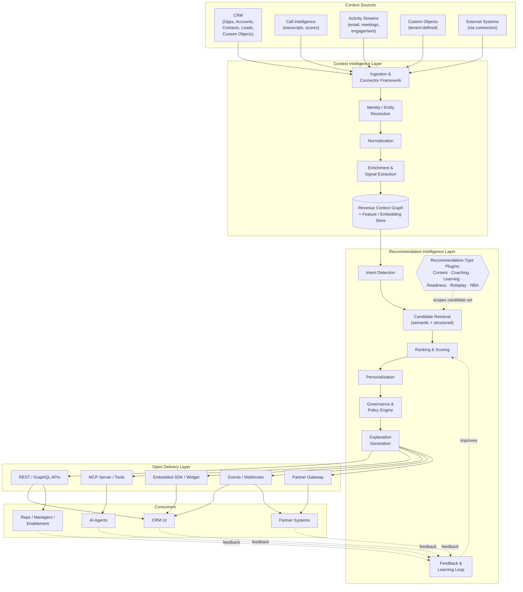
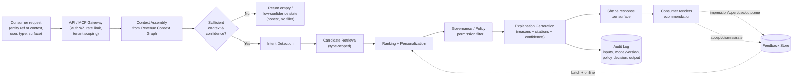
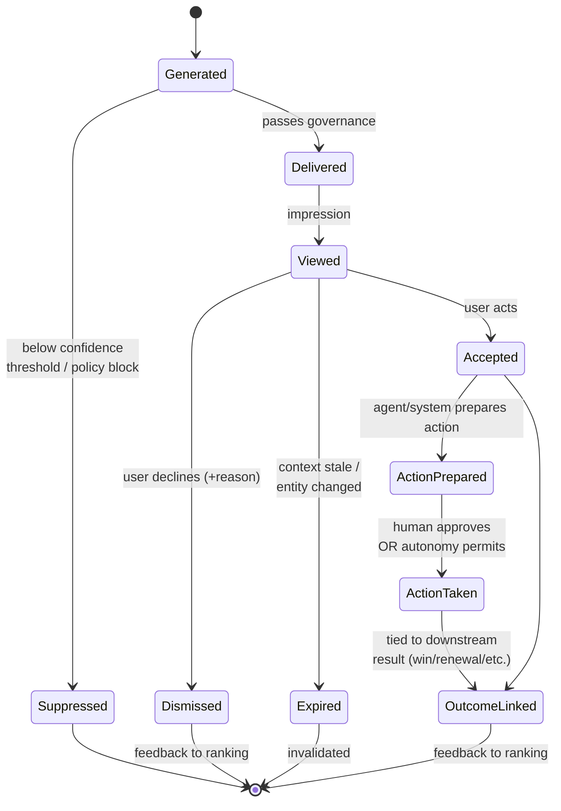
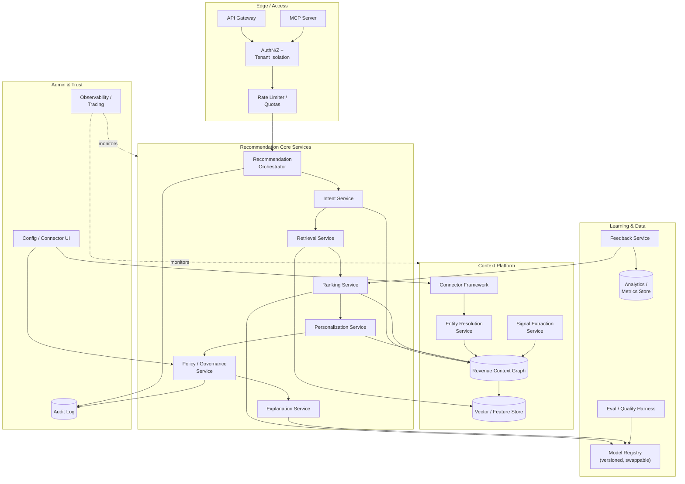
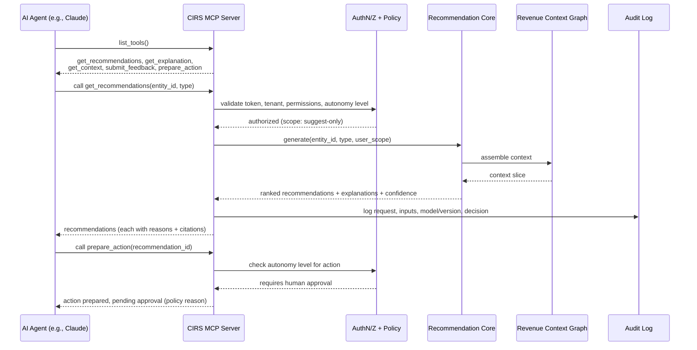

# Artifact 3 — Architecture Package

# Context Intelligence Recommendation Service — Architecture

**Purpose:** Establish technical credibility for the *Revenue Context Intelligence Platform*. All diagrams are Mermaid (render in GitHub, Notion, VS Code, mermaid.live). API and MCP definitions are illustrative but implementation-shaped.

**Contents**
1. System Architecture Diagram
2. Data Flow Diagram
3. Recommendation Lifecycle Diagram
4. Platform Component Diagram
5. MCP Integration Diagram
6. API Design
7. Sample Recommendation Payload (JSON)
8. Sample MCP Tool Definitions

---

## 1. System Architecture Diagram

Four-layer architecture: context flows up from sources, through intelligence, out to any consumer. The **Revenue Context Graph** is the durable, compounding core; models above it are swappable.



---

## 2. Data Flow Diagram

How a single recommendation request flows through the system, including governance and the asynchronous feedback path.



---

## 3. Recommendation Lifecycle Diagram

The state machine of a recommendation, from generation to outcome — including suppression, expiry, and (governed) autonomous action.



---

## 4. Platform Component Diagram

Logical components and their dependencies — what a build team would own.



---

## 5. MCP Integration Diagram

How an AI agent consumes the platform through the Model Context Protocol — governed, permission-aware, audited. This is the bet for the agentic era.



---

## 6. API Design

API-first: every internal surface (including our own CRM UI) consumes these same public, versioned APIs. REST for transactions, GraphQL for flexible context queries, webhooks for proactive delivery. All requests are tenant-scoped via the auth token.

**Conventions:** Base path `/v1`. Auth via OAuth2 bearer (tenant + user scoped). Standard errors with `error.code`, `error.message`, `error.retry_after`. Idempotency keys on writes.

### `POST /v1/context`
Push or upsert context for an entity (used by connectors/partners; most context arrives via ingestion).

```http
POST /v1/context
Content-Type: application/json

{
  "entity": {
    "type": "opportunity",
    "external_id": "0061a00000ABCDE",
    "source": "crm",
    "attributes": {
      "stage": "Negotiation",
      "amount": 120000,
      "days_in_stage": 23,
      "product": "Platform",
      "account_id": "0011a00000XYZ"
    }
  }
}
```
**Response `202 Accepted`:** `{ "entity_id": "ctx_op_8f3a...", "status": "queued", "lineage_id": "lin_..." }`

### `POST /v1/recommendations`
Request recommendations for a context (on-demand). Primary endpoint.

```http
POST /v1/recommendations
Content-Type: application/json

{
  "target": { "entity_id": "ctx_op_8f3a..." },
  "types": ["content", "next_best_action"],
  "user_id": "usr_rep_204",
  "surface": "crm",
  "max_results": 3,
  "constraints": { "min_confidence": 0.6 }
}
```
**Response `200 OK`:** ranked recommendations (see §7).

### `GET /v1/recommendations`
Retrieve previously generated recommendations (e.g., for a surface re-render or audit).

```http
GET /v1/recommendations?target_entity_id=ctx_op_8f3a...&user_id=usr_rep_204&status=delivered
```
**Response `200 OK`:** `{ "recommendations": [ ... ], "page": { "next": null } }`

### `POST /v1/feedback`
Submit explicit/implicit feedback for the learning loop.

```http
POST /v1/feedback
Content-Type: application/json

{
  "recommendation_id": "rec_9c21...",
  "user_id": "usr_rep_204",
  "feedback_type": "dismiss",
  "reason": "already_sent",
  "value": null
}
```
**Response `202 Accepted`:** `{ "status": "recorded" }`

### `GET /v1/explanations/{recommendation_id}`
Retrieve the full reasoning, inputs, and confidence for any recommendation (powers explainability UI and audits).

```http
GET /v1/explanations/rec_9c21...
```
**Response `200 OK`:**
```json
{
  "recommendation_id": "rec_9c21...",
  "confidence": 0.82,
  "model_version": "rank-v3.2",
  "reasons": [
    "Deal has been in Negotiation for 23 days — 2x the win-rate-optimal duration for this segment.",
    "Last call transcript flagged unresolved pricing objection.",
    "Economic buyer has not engaged in 14 days."
  ],
  "source_signals": [
    { "type": "deal_stage_duration", "source": "crm", "value": 23, "weight": 0.41 },
    { "type": "call_objection", "source": "call_intelligence", "value": "pricing", "weight": 0.34 },
    { "type": "buyer_engagement_gap", "source": "activity_stream", "value": 14, "weight": 0.25 }
  ]
}
```

### Webhooks (proactive delivery)
Tenants subscribe to `recommendation.created` / `recommendation.high_priority` events to push context-triggered recommendations into their surfaces without polling.

---

## 7. Sample Recommendation Payload (JSON)

Response from `POST /v1/recommendations`. Note: every recommendation carries `confidence`, `explanation` (reasons + cited sources), and `delivery`/governance metadata — explainability is structural, not optional.

```json
{
  "request_id": "req_44ad21",
  "tenant_id": "tnt_acme",
  "target": {
    "entity_id": "ctx_op_8f3a",
    "type": "opportunity",
    "display_name": "Acme – Platform Expansion"
  },
  "generated_at": "2026-06-18T15:42:10Z",
  "recommendations": [
    {
      "recommendation_id": "rec_9c21",
      "type": "next_best_action",
      "title": "Engage the economic buyer with an ROI business case",
      "action": {
        "kind": "suggested_action",
        "description": "Send the ROI calculator and request a 20-min exec alignment call.",
        "autonomy_level": "suggest_only"
      },
      "score": 0.91,
      "confidence": 0.82,
      "explanation": {
        "reasons": [
          "Deal stuck in Negotiation for 23 days (2x segment norm).",
          "Unresolved pricing objection on last call.",
          "Economic buyer disengaged for 14 days."
        ],
        "source_signals": [
          { "type": "deal_stage_duration", "source": "crm", "value": 23 },
          { "type": "call_objection", "source": "call_intelligence", "value": "pricing" },
          { "type": "buyer_engagement_gap", "source": "activity_stream", "value": 14 }
        ]
      },
      "delivery": { "surface": "crm", "priority": "high" },
      "governance": { "policy_passed": true, "permission_scoped": true }
    },
    {
      "recommendation_id": "rec_9c22",
      "type": "content",
      "title": "ROI Calculator – Platform (Enterprise)",
      "candidate_id": "cnt_roi_017",
      "score": 0.88,
      "confidence": 0.79,
      "explanation": {
        "reasons": [
          "Directly addresses the pricing objection raised on the last call.",
          "Top-performing asset for deals at this stage in this segment."
        ],
        "source_signals": [
          { "type": "call_objection", "source": "call_intelligence", "value": "pricing" },
          { "type": "asset_outcome_stats", "source": "platform", "value": "win_rate_lift_18pct" }
        ]
      },
      "delivery": { "surface": "crm", "priority": "medium" },
      "governance": { "policy_passed": true, "permission_scoped": true }
    }
  ],
  "diagnostics": {
    "context_completeness": 0.86,
    "model_version": "rank-v3.2",
    "latency_ms": 412
  }
}
```

---

## 8. Sample MCP Tool Definitions

First-party MCP tools exposing the platform to AI agents — governed, permission-aware, and explainable by design. These make CIRS natively callable by Claude and any agentic workflow.

```json
{
  "tools": [
    {
      "name": "get_recommendations",
      "description": "Get ranked, explainable revenue recommendations for a context entity. Returns content, coaching, learning, readiness, roleplay, or next-best-action recommendations. All results are tenant- and permission-scoped and include reasons, cited sources, and a confidence score.",
      "input_schema": {
        "type": "object",
        "properties": {
          "entity_id": { "type": "string", "description": "ID of the context entity (opportunity, account, contact, lead, call, activity, or custom object)." },
          "types": {
            "type": "array",
            "items": { "type": "string", "enum": ["content", "coaching", "learning", "readiness", "roleplay", "next_best_action"] },
            "description": "Recommendation types to request."
          },
          "max_results": { "type": "integer", "default": 3 },
          "min_confidence": { "type": "number", "default": 0.6 }
        },
        "required": ["entity_id", "types"]
      }
    },
    {
      "name": "get_explanation",
      "description": "Retrieve the full reasoning, source signals, and confidence behind a specific recommendation. Use to justify a recommendation before acting on it.",
      "input_schema": {
        "type": "object",
        "properties": {
          "recommendation_id": { "type": "string" }
        },
        "required": ["recommendation_id"]
      }
    },
    {
      "name": "get_context",
      "description": "Look up the unified revenue context (signals: intent, risk, momentum, engagement) for an entity from the Revenue Context Graph. Read-only and permission-scoped.",
      "input_schema": {
        "type": "object",
        "properties": {
          "entity_id": { "type": "string" },
          "signal_types": { "type": "array", "items": { "type": "string" } }
        },
        "required": ["entity_id"]
      }
    },
    {
      "name": "submit_feedback",
      "description": "Submit feedback on a recommendation (accept, dismiss, rate) to improve future relevance.",
      "input_schema": {
        "type": "object",
        "properties": {
          "recommendation_id": { "type": "string" },
          "feedback_type": { "type": "string", "enum": ["accept", "dismiss", "rate"] },
          "reason": { "type": "string" },
          "value": { "type": "number", "description": "Rating value when feedback_type is 'rate'." }
        },
        "required": ["recommendation_id", "feedback_type"]
      }
    },
    {
      "name": "prepare_action",
      "description": "Prepare (but do not necessarily execute) the action implied by a next-best-action recommendation. Execution is gated by the tenant's autonomy policy; if autonomy is below the required level, the action is returned for human approval with the governing policy reason.",
      "input_schema": {
        "type": "object",
        "properties": {
          "recommendation_id": { "type": "string" }
        },
        "required": ["recommendation_id"]
      }
    }
  ]
}
```

**Governance note:** Every MCP call passes through the same AuthN/Z, tenant-isolation, policy, and audit path as the REST API. An agent can never exceed the autonomy level an admin has configured for a recommendation type — `prepare_action` will return a pending-approval state rather than acting when policy requires a human.

---

*End of Artifact 3.*
