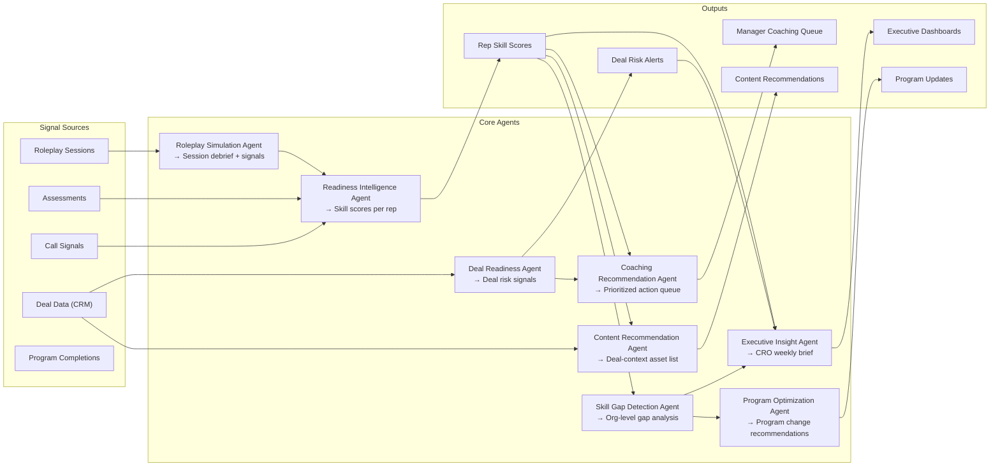
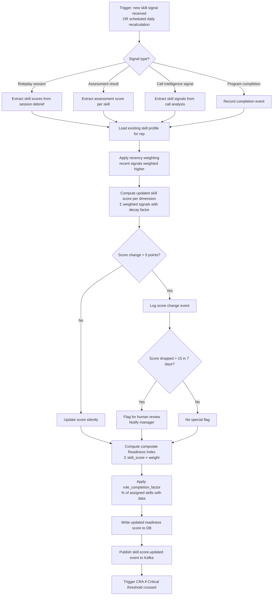
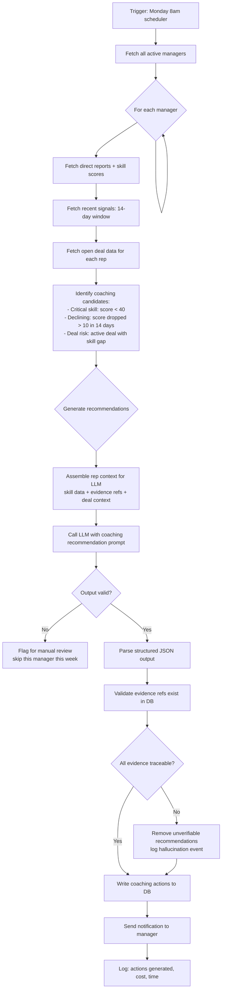
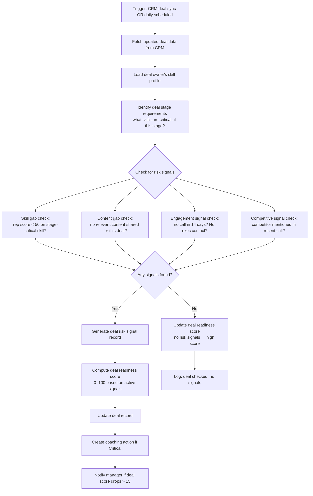

# Agent Workflow Diagrams

---

## Agent Map

```mermaid
graph LR
    subgraph "Signal Sources"
        RP["Roleplay Sessions"]
        ASSESS["Assessments"]
        CALLS["Call Signals"]
        DEALS["Deal Data (CRM)"]
        PROG["Program Completions"]
    end

    subgraph "Core Agents"
        RI["Readiness Intelligence Agent<br/>→ Skill scores per rep"]
        RPA["Roleplay Simulation Agent<br/>→ Session debrief + signals"]
        CRA["Coaching Recommendation Agent<br/>→ Prioritized action queue"]
        CA["Content Recommendation Agent<br/>→ Deal-context asset list"]
        SGA["Skill Gap Detection Agent<br/>→ Org-level gap analysis"]
        DA["Deal Readiness Agent<br/>→ Deal risk signals"]
        EA["Executive Insight Agent<br/>→ CRO weekly brief"]
        PA["Program Optimization Agent<br/>→ Program change recommendations"]
    end

    subgraph "Outputs"
        SCORES["Rep Skill Scores"]
        QUEUE["Manager Coaching Queue"]
        CONTENT["Content Recommendations"]
        DEALS_OUT["Deal Risk Alerts"]
        EXEC_OUT["Executive Dashboards"]
        PROG_OUT["Program Updates"]
    end

    RP --> RPA --> RI
    ASSESS --> RI
    CALLS --> RI
    RI --> SCORES

    SCORES --> CRA --> QUEUE
    DEALS --> DA --> DEALS_OUT
    DA --> CRA

    SCORES --> CA --> CONTENT
    DEALS --> CA

    SCORES --> SGA --> PA --> PROG_OUT
    SGA --> EA

    SCORES --> EA --> EXEC_OUT
    DEALS_OUT --> EA
```

---

## Readiness Intelligence Agent — Full Flow

```mermaid
flowchart TD
    A[Trigger: new skill signal received<br/>OR scheduled daily recalculation] --> B{Signal type?}

    B -->|Roleplay session| C[Extract skill scores from session debrief]
    B -->|Assessment result| D[Extract assessment score per skill]
    B -->|Call intelligence signal| E[Extract skill signals from call analysis]
    B -->|Program completion| F[Record completion event]

    C & D & E & F --> G[Load existing skill profile for rep]

    G --> H[Apply recency weighting<br/>recent signals weighted higher]

    H --> I[Compute updated skill score per dimension<br/>Σ weighted signals with decay factor]

    I --> J{Score change > 5 points?}
    J -->|Yes| K[Log score change event]
    J -->|No| L[Update score silently]

    K --> M{Score dropped > 15 in 7 days?}
    M -->|Yes| N[Flag for human review<br/>Notify manager]
    M -->|No| O[No special flag]

    L & N & O --> P[Compute composite Readiness Index<br/>Σ skill_score × weight]

    P --> Q[Apply role_completion_factor<br/>% of assigned skills with data]

    Q --> R[Write updated readiness score to DB]
    R --> S[Publish skill.score.updated event to Kafka]
    S --> T[Trigger CRA if Critical threshold crossed]
```

---

## Coaching Recommendation Agent — Weekly Flow

```mermaid
flowchart TD
    START[Trigger: Monday 8am scheduler] --> A[Fetch all active managers]

    A --> B{For each manager}

    B --> C[Fetch direct reports + skill scores]
    C --> D[Fetch recent signals: 14-day window]
    D --> E[Fetch open deal data for each rep]

    E --> F[Identify coaching candidates:<br/>- Critical skill: score < 40<br/>- Declining: score dropped > 10 in 14 days<br/>- Deal risk: active deal with skill gap]

    F --> G{Generate recommendations}

    G --> H[Assemble rep context for LLM<br/>skill data + evidence refs + deal context]
    H --> I[Call LLM with coaching recommendation prompt]
    I --> J{Output valid?}

    J -->|No| K[Flag for manual review<br/>skip this manager this week]
    J -->|Yes| L[Parse structured JSON output]

    L --> M[Validate evidence refs exist in DB]
    M --> N{All evidence traceable?}

    N -->|No| O[Remove unverifiable recommendations<br/>log hallucination event]
    N -->|Yes| P[Write coaching actions to DB]

    O --> P
    P --> Q[Send notification to manager]
    Q --> R[Log: actions generated, cost, time]

    B --> B
```

---

## Deal Readiness Agent — Trigger Flow

```mermaid
flowchart TD
    A[Trigger: CRM deal sync OR daily scheduled] --> B[Fetch updated deal data from CRM]

    B --> C[Load deal owner's skill profile]
    C --> D[Identify deal stage requirements<br/>what skills are critical at this stage?]

    D --> E{Check for risk signals}

    E --> F[Skill gap check:<br/>rep score < 50 on stage-critical skill?]
    E --> G[Content gap check:<br/>no relevant content shared for this deal?]
    E --> H[Engagement signal check:<br/>no call in 14 days? No exec contact?]
    E --> I[Competitive signal check:<br/>competitor mentioned in recent call?]

    F & G & H & I --> J{Any signals found?}

    J -->|Yes| K[Generate deal risk signal record]
    K --> L[Compute deal readiness score<br/>0–100 based on active signals]
    L --> M[Update deal record]
    M --> N[Create coaching action if Critical]
    N --> O[Notify manager if deal score drops > 15]

    J -->|No| P[Update deal readiness score<br/>no risk signals → high score]
    P --> Q[Log: deal checked, no signals]
```
