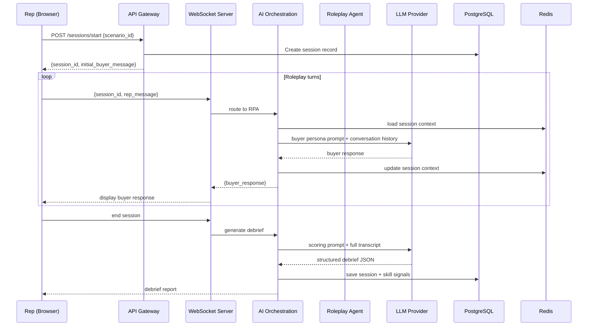
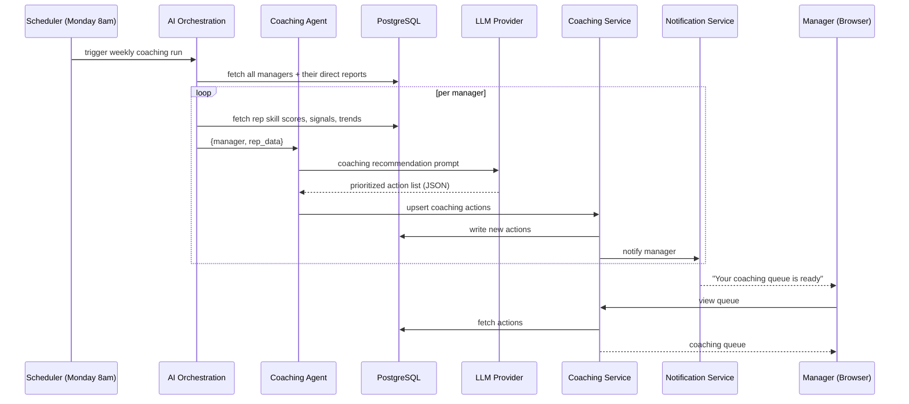

# System Architecture Diagram

---

## Full Platform Architecture

```mermaid
graph TB
    subgraph "Client Layer"
        WEB["Web App<br/>(React/TypeScript)"]
        MOBILE["Mobile App<br/>(Future)"]
    end

    subgraph "Edge / API Layer"
        CDN["CDN / WAF"]
        GW["API Gateway<br/>(Auth, Rate Limiting, Routing)"]
        WS["WebSocket Server<br/>(Real-time Roleplay)"]
    end

    subgraph "Domain Services"
        US["User &amp; Identity<br/>Service"]
        LS["Learning &amp; Certification<br/>Service"]
        CS["Coaching<br/>Service"]
        CNT["Content<br/>Service"]
        AN["Analytics<br/>Service"]
        NT["Notification<br/>Service"]
        INT["Integration<br/>Service"]
    end

    subgraph "AI Orchestration Layer"
        AO["Agent Scheduler<br/>&amp; Router"]
        PM["Prompt Manager<br/>(versioned templates)"]
        CTX["Context<br/>Assembler"]
        VAL["Output Validator<br/>&amp; Parser"]
        COST["Cost Tracker<br/>&amp; Audit Logger"]
    end

    subgraph "Agents"
        RI["Readiness Intelligence<br/>Agent"]
        RPA["Roleplay Simulation<br/>Agent"]
        CRA["Coaching Recommendation<br/>Agent"]
        CA["Content Recommendation<br/>Agent"]
        SGA["Skill Gap Detection<br/>Agent"]
        DA["Deal Readiness<br/>Agent"]
        EA["Executive Insight<br/>Agent"]
        PA["Program Optimization<br/>Agent"]
    end

    subgraph "Data Layer"
        PG[("PostgreSQL<br/>(Transactional)")]
        VDB[("Vector DB<br/>(Pinecone)")]
        ES[("Elasticsearch<br/>(Content Search)")]
        DW[("Data Warehouse<br/>(Snowflake)")]
        CACHE[("Redis<br/>(Cache + Session)")]
        KAFKA["Kafka<br/>(Event Stream)"]
    end

    subgraph "External Systems"
        LLM["LLM Provider<br/>(OpenAI / Anthropic)"]
        CRM["CRM<br/>(Salesforce / HubSpot)"]
        CALL["Call Intelligence"]
        SSO["Identity Provider<br/>(Okta / Azure AD)"]
        LMS["External LMS<br/>(Optional)"]
    end

    WEB --> CDN
    MOBILE --> CDN
    CDN --> GW
    CDN --> WS

    GW --> US & LS & CS & CNT & AN & NT & INT

    WS --> AO

    US --> SSO
    US --> PG
    LS --> PG
    CS --> PG
    CNT --> ES & VDB & PG
    AN --> DW & PG
    INT --> CRM & CALL & LMS

    Domain_Services --> KAFKA
    KAFKA --> AN
    KAFKA --> AO

    AO --> PM & CTX & VAL & COST
    AO --> RI & RPA & CRA & CA & SGA & DA & EA & PA

    Agents --> LLM
    RI & CRA & SGA & EA --> PG
    CA --> VDB & ES
    RPA --> VDB
    DA --> CRM

    CS --> CACHE
    AN --> CACHE
```

---

## Data Flow: Roleplay Session

```mermaid
sequenceDiagram
    participant Rep as Rep (Browser)
    participant GW as API Gateway
    participant WS as WebSocket Server
    participant AO as AI Orchestration
    participant RPA as Roleplay Agent
    participant LLM as LLM Provider
    participant DB as PostgreSQL
    participant CACHE as Redis

    Rep->>GW: POST /sessions/start {scenario_id}
    GW->>DB: Create session record
    GW-->>Rep: {session_id, initial_buyer_message}

    loop Roleplay turns
        Rep->>WS: {session_id, rep_message}
        WS->>AO: route to RPA
        AO->>CACHE: load session context
        AO->>LLM: buyer persona prompt + conversation history
        LLM-->>AO: buyer response
        AO->>CACHE: update session context
        AO-->>WS: {buyer_response}
        WS-->>Rep: display buyer response
    end

    Rep->>WS: end session
    WS->>AO: generate debrief
    AO->>LLM: scoring prompt + full transcript
    LLM-->>AO: structured debrief JSON
    AO->>DB: save session + skill signals
    AO-->>Rep: debrief report
```

---

## Data Flow: Weekly Coaching Queue

```mermaid
sequenceDiagram
    participant CRON as Scheduler (Monday 8am)
    participant AO as AI Orchestration
    participant CRA as Coaching Agent
    participant DB as PostgreSQL
    participant LLM as LLM Provider
    participant CS as Coaching Service
    participant NT as Notification Service
    participant MGR as Manager (Browser)

    CRON->>AO: trigger weekly coaching run
    AO->>DB: fetch all managers + their direct reports
    loop per manager
        AO->>DB: fetch rep skill scores, signals, trends
        AO->>CRA: {manager, rep_data}
        CRA->>LLM: coaching recommendation prompt
        LLM-->>CRA: prioritized action list (JSON)
        CRA->>CS: upsert coaching actions
        CS->>DB: write new actions
        CS->>NT: notify manager
    end
    NT-->>MGR: "Your coaching queue is ready"
    MGR->>CS: view queue
    CS->>DB: fetch actions
    CS-->>MGR: coaching queue
```
