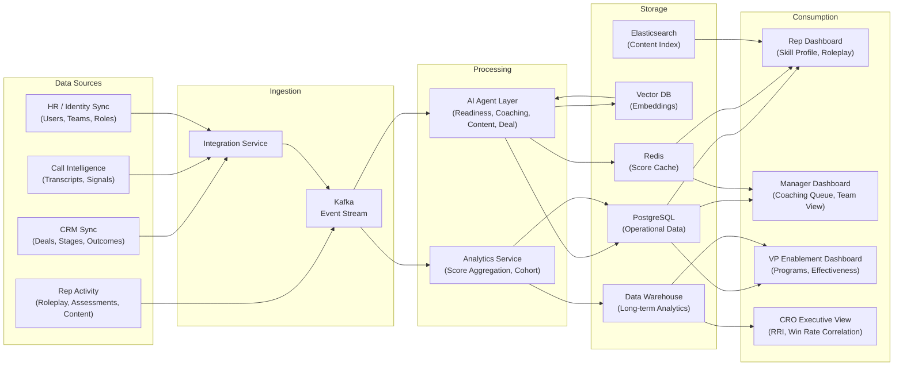
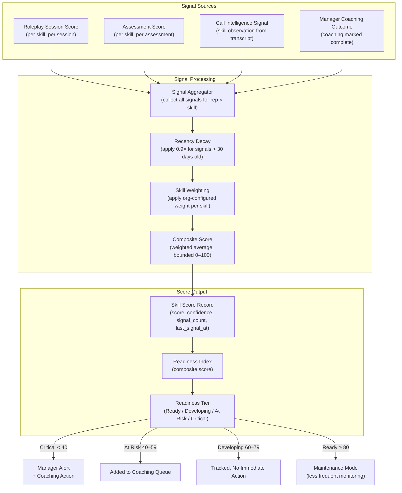
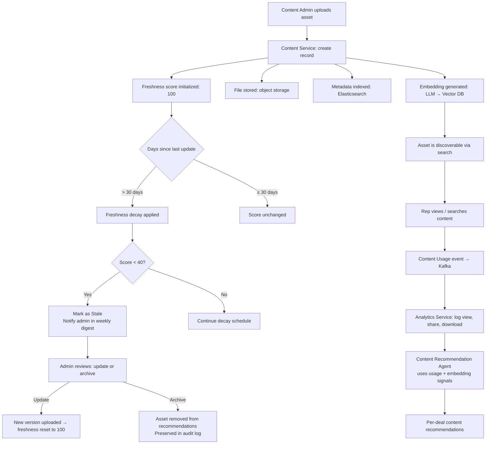
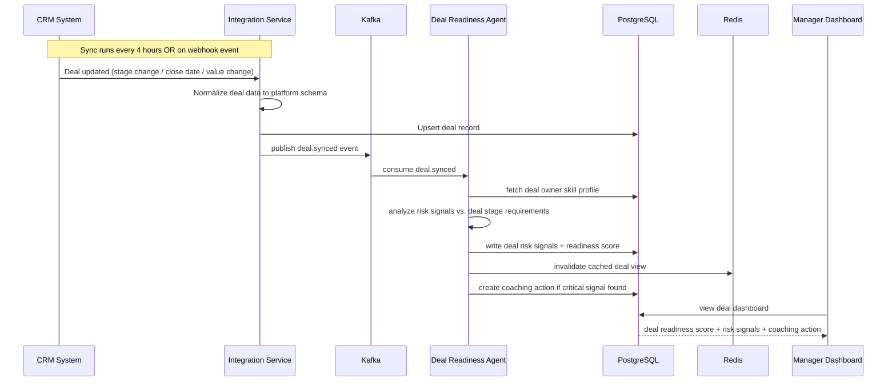

# Data Flow Diagrams

---

## Platform Data Flow Overview

```mermaid
graph LR
    subgraph "Data Sources"
        REP_ACT["Rep Activity<br/>(Roleplay, Assessments, Content)"]
        CRM_SYNC["CRM Sync<br/>(Deals, Stages, Outcomes)"]
        CALL_INT["Call Intelligence<br/>(Transcripts, Signals)"]
        HR_SYNC["HR / Identity Sync<br/>(Users, Teams, Roles)"]
    end

    subgraph "Ingestion"
        KAFKA["Kafka<br/>Event Stream"]
        INT_SVC["Integration Service"]
    end

    subgraph "Processing"
        AGENTS["AI Agent Layer<br/>(Readiness, Coaching, Content, Deal)"]
        ANALYTICS["Analytics Service<br/>(Score Aggregation, Cohort)"]
    end

    subgraph "Storage"
        PG["PostgreSQL<br/>(Operational Data)"]
        VDB["Vector DB<br/>(Embeddings)"]
        ES["Elasticsearch<br/>(Content Index)"]
        DW["Data Warehouse<br/>(Long-term Analytics)"]
        CACHE["Redis<br/>(Score Cache)"]
    end

    subgraph "Consumption"
        REP_UI["Rep Dashboard<br/>(Skill Profile, Roleplay)"]
        MGR_UI["Manager Dashboard<br/>(Coaching Queue, Team View)"]
        VPE_UI["VP Enablement Dashboard<br/>(Programs, Effectiveness)"]
        CRO_UI["CRO Executive View<br/>(RRI, Win Rate Correlation)"]
    end

    REP_ACT --> KAFKA
    CRM_SYNC --> INT_SVC
    CALL_INT --> INT_SVC
    HR_SYNC --> INT_SVC

    KAFKA --> AGENTS
    KAFKA --> ANALYTICS
    INT_SVC --> KAFKA

    AGENTS --> PG & VDB & CACHE
    ANALYTICS --> PG & DW

    PG --> REP_UI & MGR_UI & VPE_UI
    DW --> CRO_UI & VPE_UI
    CACHE --> REP_UI & MGR_UI
    ES --> REP_UI
    VDB --> AGENTS
```

---

## Skill Signal Aggregation Flow

```mermaid
flowchart TD
    subgraph "Signal Sources"
        S1["Roleplay Session Score<br/>(per skill, per session)"]
        S2["Assessment Score<br/>(per skill, per assessment)"]
        S3["Call Intelligence Signal<br/>(skill observation from transcript)"]
        S4["Manager Coaching Outcome<br/>(coaching marked complete)"]
    end

    subgraph "Signal Processing"
        AGG["Signal Aggregator<br/>(collect all signals for rep × skill)"]
        DECAY["Recency Decay<br/>(apply 0.9× for signals > 30 days old)"]
        WEIGHT["Skill Weighting<br/>(apply org-configured weight per skill)"]
        COMP["Composite Score<br/>(weighted average, bounded 0–100)"]
    end

    subgraph "Score Output"
        SKILL_SCORE["Skill Score Record<br/>(score, confidence, signal_count, last_signal_at)"]
        RRI["Readiness Index<br/>(composite score)"]
        TIER["Readiness Tier<br/>(Ready / Developing / At Risk / Critical)"]
    end

    S1 & S2 & S3 & S4 --> AGG
    AGG --> DECAY --> WEIGHT --> COMP
    COMP --> SKILL_SCORE
    SKILL_SCORE --> RRI
    RRI --> TIER

    TIER -->|Critical < 40| ALERT["Manager Alert<br/>+ Coaching Action"]
    TIER -->|At Risk 40–59| QUEUE["Added to Coaching Queue"]
    TIER -->|Developing 60–79| TRACK["Tracked, No Immediate Action"]
    TIER -->|Ready ≥ 80| MAINT["Maintenance Mode<br/>(less frequent monitoring)"]
```

---

## Content Lifecycle Data Flow

```mermaid
flowchart TD
    A["Content Admin uploads asset"] --> B["Content Service: create record"]
    B --> C["Freshness score initialized: 100"]
    B --> D["File stored: object storage"]
    B --> E["Metadata indexed: Elasticsearch"]
    B --> F["Embedding generated: LLM → Vector DB"]

    F --> G["Asset is discoverable via search"]
    G --> H["Rep views / searches content"]

    H --> I["Content Usage event → Kafka"]
    I --> J["Analytics Service: log view, share, download"]

    C --> K{Days since last update}
    K -->|> 30 days| L["Freshness decay applied"]
    K -->|≤ 30 days| M["Score unchanged"]

    L --> N{Score < 40?}
    N -->|Yes| O["Mark as Stale<br/>Notify admin in weekly digest"]
    N -->|No| P["Continue decay schedule"]

    O --> Q["Admin reviews: update or archive"]
    Q -->|Update| R["New version uploaded → freshness reset to 100"]
    Q -->|Archive| S["Asset removed from recommendations<br/>Preserved in audit log"]

    J --> T["Content Recommendation Agent<br/>uses usage + embedding signals"]
    T --> U["Per-deal content recommendations"]
```

---

## CRM Integration Data Flow

```mermaid
sequenceDiagram
    participant CRM as CRM System
    participant INT as Integration Service
    participant KAFKA as Kafka
    participant DA as Deal Readiness Agent
    participant DB as PostgreSQL
    participant CACHE as Redis
    participant MGR as Manager Dashboard

    Note over CRM, INT: Sync runs every 4 hours OR on webhook event

    CRM->>INT: Deal updated (stage change / close date / value change)
    INT->>INT: Normalize deal data to platform schema
    INT->>DB: Upsert deal record
    INT->>KAFKA: publish deal.synced event

    KAFKA->>DA: consume deal.synced
    DA->>DB: fetch deal owner skill profile
    DA->>DA: analyze risk signals vs. deal stage requirements
    DA->>DB: write deal risk signals + readiness score
    DA->>CACHE: invalidate cached deal view

    DA->>DB: create coaching action if critical signal found

    MGR->>DB: view deal dashboard
    DB-->>MGR: deal readiness score + risk signals + coaching action
```
