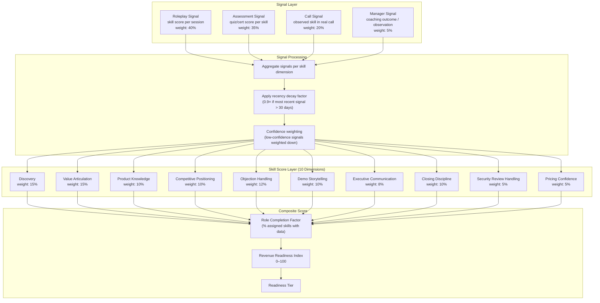
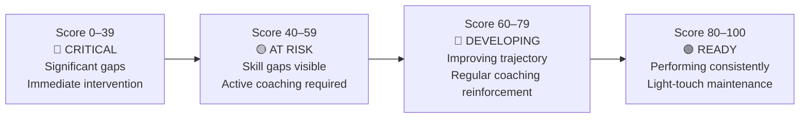
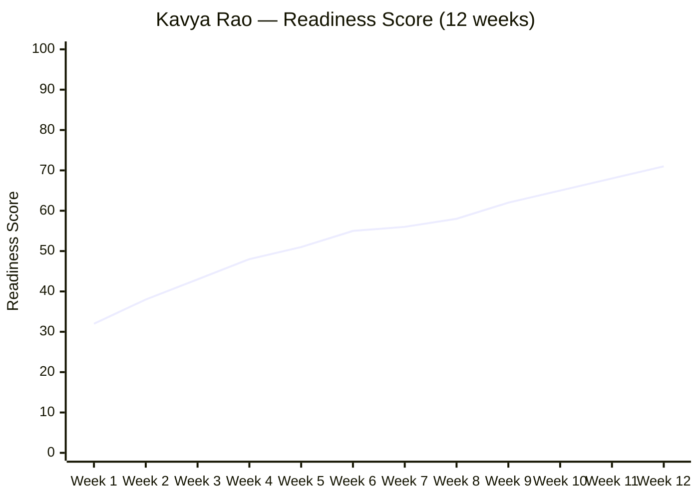
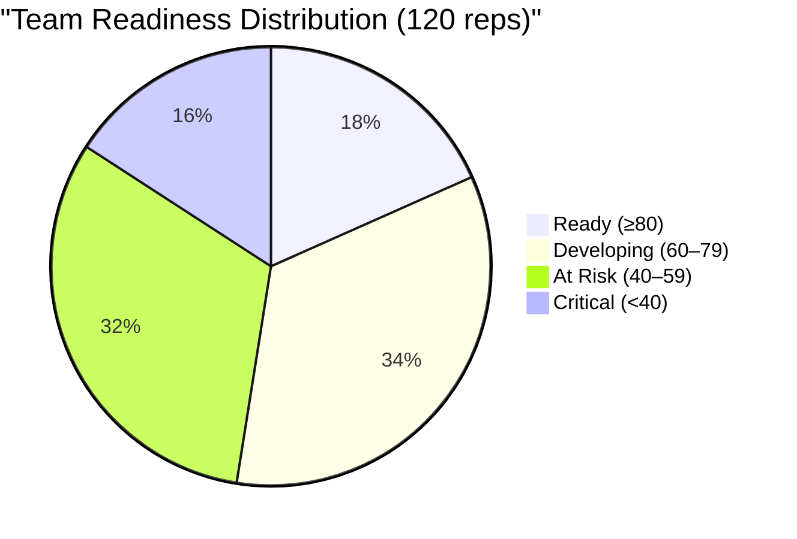

# Readiness Score Model

---

## Score Architecture



---

## Score Formula

```
ReadinessScore = Σ(skill_score[i] × skill_weight[i]) × recency_decay_factor × role_completion_factor

Where:
  skill_score[i]           = weighted aggregate of signals for skill i (0–100)
  skill_weight[i]          = configured importance weight for skill i (sum = 1.0)
  recency_decay_factor     = 1.0 if most recent signal in last 30 days, else 0.9
  role_completion_factor   = (skills with ≥1 signal) / (total assigned skills for role)
```

---

## Tier Definitions



---

## Score Composition Example

Kavya Rao — Enterprise AE (90 days tenured)

| Skill | Score | Weight | Weighted | Signal Count | Most Recent Signal |
|-------|-------|--------|----------|-------------|-------------------|
| Discovery | 52 | 0.15 | 7.80 | 4 | 5 days ago |
| Value Articulation | 68 | 0.15 | 10.20 | 3 | 12 days ago |
| Product Knowledge | 71 | 0.10 | 7.10 | 5 | 3 days ago |
| Competitive Positioning | 45 | 0.10 | 4.50 | 2 | 18 days ago |
| Objection Handling | 58 | 0.12 | 6.96 | 3 | 8 days ago |
| Demo Storytelling | 74 | 0.10 | 7.40 | 4 | 2 days ago |
| Executive Communication | 42 | 0.08 | 3.36 | 1 | 35 days ago |
| Closing Discipline | 55 | 0.10 | 5.50 | 2 | 22 days ago |
| Security Review Handling | 48 | 0.05 | 2.40 | 1 | 40 days ago |
| Pricing Confidence | 50 | 0.05 | 2.50 | 1 | 28 days ago |
| **Total** | | **1.00** | **57.72** | | |

```
recency_decay_factor = 1.0 (most recent signal is 2 days ago)
role_completion_factor = 10/10 = 1.0 (all skills have at least 1 signal)

ReadinessScore = 57.72 × 1.0 × 1.0 = 58 → AT RISK tier
```

**Top gaps by weighted impact:**
1. Discovery (52 × 0.15 = 7.80 actual vs. 15.00 if at 100) → gap: 7.20
2. Competitive Positioning (45 × 0.10 = 4.50 actual vs. 10.00) → gap: 5.50
3. Executive Communication (42 × 0.08 = 3.36 actual vs. 8.00) → gap: 4.64

---

## Score Trend Over Time



**Milestones visible in trend:**
- Week 1–4: Rapid gain from baseline assessments and first roleplay sessions
- Week 5–8: Plateau — Discovery and Competitive gaps limiting composite growth
- Week 9+: Renewed gain after focused coaching from Rohan + 3 targeted roleplay sessions

---

## Org-Level Readiness Distribution



**Platform target at 12 months:** Critical < 10%, Ready ≥ 35%
