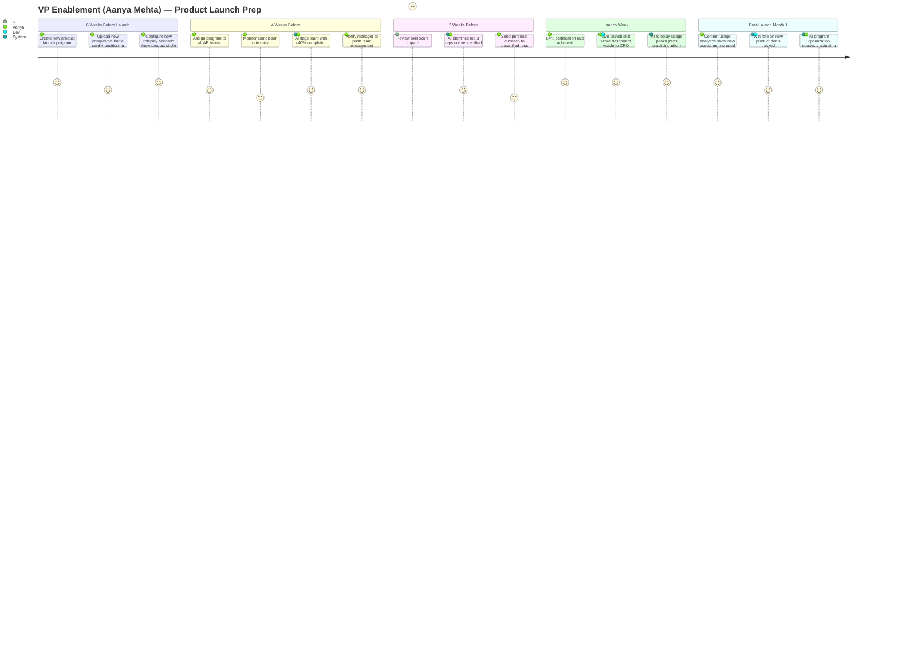
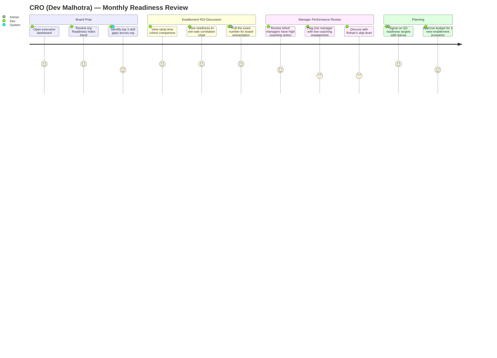
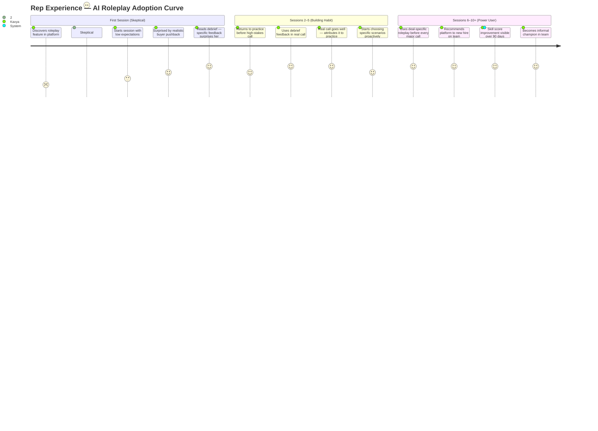

# User Journey Maps

---

## Journey 1: New AE Onboarding (30-Day Ramp)

```mermaid
journey
    title New AE (Kavya Rao) — 30-Day Ramp Journey
    section Week 1: Orientation
        Complete baseline skill assessment: 3: Kavya
        Receive personalized 30-day ramp plan: 4: Kavya, System
        Start Module 1 (Company & Product Overview): 3: Kavya
        First AI roleplay session (beginner scenario): 3: Kavya
    section Week 2: Skill Foundation
        Complete discovery framework module: 4: Kavya
        AI roleplay (discovery scenario): 4: Kavya
        Manager 1:1 with coaching brief: 5: Kavya, Rohan
        View skill score update after roleplay: 4: Kavya
    section Week 3: Applied Practice
        AI roleplay (objection handling scenario): 4: Kavya
        Complete value articulation certification: 4: Kavya
        Access competitive battle cards for first real call: 4: Kavya
        Manager reviews roleplay debrief: 5: Rohan
    section Week 4: Deal-Ready
        Complete pricing confidence module: 3: Kavya
        AI roleplay (full discovery + value call): 5: Kavya
        Readiness score reaches 65+ (Developing tier): 5: Kavya, System
        First assisted deal handoff: 4: Kavya, Rohan
```

---

## Journey 2: Weekly Manager Coaching Cycle

```mermaid
journey
    title Manager (Rohan Shah) — Weekly Coaching Rhythm
    section Monday Morning
        Open coaching queue (pre-populated by AI): 5: Rohan
        Review 3 prioritized coaching actions: 5: Rohan
        Read specific evidence per action: 4: Rohan
    section Mid-Week 1:1s
        1:1 with Kavya — coaching on Discovery gap: 5: Rohan, Kavya
        Mark coaching action complete with note: 4: Rohan
        Dismiss one action (already addressed): 5: Rohan
    section Thursday Team Review
        Review team readiness heatmap: 4: Rohan
        Flag one rep as at-risk for enablement admin: 4: Rohan, Aanya
    section Friday Close
        Queue auto-refreshes for next week: 5: System
        Rohan reviews completed actions log: 3: Rohan
```

---

## Journey 3: Product Launch Readiness



---

## Journey 4: CRO Executive Review



---

## Emotional Journey: AI Roleplay — First Time vs. Tenth Time


