# System Architecture

---

## Architecture Overview

Revenue Readiness OS is a cloud-native, multi-tenant SaaS platform built on a microservices architecture. The platform is organized into five layers: frontend, API gateway, domain services, AI orchestration, and data infrastructure.

```mermaid
graph TB
    subgraph Frontend
        WA[Web App - React/TypeScript]
        MA[Mobile App - Future]
    end

    subgraph API Layer
        GW[API Gateway / Auth]
        WS[WebSocket Server - Real-time Roleplay]
    end

    subgraph Domain Services
        US[User & Identity Service]
        LS[Learning & Certification Service]
        CS[Coaching Service]
        CNT[Content Service]
        AN[Analytics Service]
        NT[Notification Service]
        INT[Integration Service - CRM/Call/LMS]
    end

    subgraph AI Orchestration
        AO[AI Orchestration Layer]
        RA[Readiness Intelligence Agent]
        RPA[Roleplay Simulation Agent]
        CRA[Coaching Recommendation Agent]
        CA[Content Recommendation Agent]
        SGA[Skill Gap Detection Agent]
        DA[Deal Readiness Agent]
        EA[Executive Insight Agent]
    end

    subgraph Data Infrastructure
        PG[(PostgreSQL - Transactional)]
        VDB[(Vector DB - Pinecone/Weaviate)]
        ES[(Elasticsearch - Content Search)]
        DW[(Data Warehouse - Snowflake)]
        EVT[Event Stream - Kafka]
        CACHE[(Redis Cache)]
    end

    subgraph External
        LLM[LLM Provider - OpenAI/Anthropic]
        CRM[CRM - Salesforce/HubSpot]
        CALL[Call Intelligence Integration]
        SSO[Identity Provider - Okta/Azure AD]
    end

    WA --> GW
    GW --> US & LS & CS & CNT & AN & NT & INT
    GW --> WS
    WS --> AO
    AO --> RA & RPA & CRA & CA & SGA & DA & EA
    AO --> LLM
    AO --> VDB
    AN --> DW
    INT --> CRM & CALL
    US --> SSO
    EVT --> AN & AO
    CS --> ES
    CNT --> ES & VDB
```

---

## Service Descriptions

### User & Identity Service
- Manages user profiles, roles, teams, and organization hierarchy
- Handles SSO/SAML authentication; SCIM provisioning
- Enforces role-based access control (RBAC) across all platform surfaces
- Manages tenant isolation at the data layer

### Learning & Certification Service
- Manages programs, modules, lessons, assessments, and certifications
- Tracks completion events, scores, and certification status
- Publishes completion events to the event stream for skill score updates
- Supports adaptive path logic (prerequisite gates, skill-based branching)

### Coaching Service
- Manages coaching queue state, coaching actions, and completion tracking
- Receives coaching recommendations from the AI Orchestration Layer
- Manages manager notes, 1:1 prep documents, and coaching history
- Publishes coaching completion events to analytics

### Content Service
- Manages content asset metadata, version history, and freshness scoring
- Tracks content usage events (views, shares, downloads) per rep and deal
- Serves as the source index for the Content Recommendation Agent (via Elasticsearch and Vector DB)
- Manages content access controls (role-based content visibility)

### Analytics Service
- Consumes all platform events via Kafka
- Computes readiness score metrics, cohort comparisons, and program effectiveness
- Writes to Data Warehouse for complex analytics queries
- Serves dashboard APIs for all reporting surfaces

### Integration Service
- Manages CRM sync (Salesforce, HubSpot) — read deal data; write activity logs
- Manages call intelligence integration (read call transcripts and signals)
- Manages LMS integration (import existing learning records)
- Handles webhook events from external systems

### Notification Service
- Manages email, in-app, and Slack notifications
- Respects user notification preferences and role-based alert thresholds
- Handles scheduled digests (weekly coaching brief, daily rep prompts)

---

## AI Orchestration Layer

The AI Orchestration Layer is the runtime environment for all platform agents. It handles:

- **Agent scheduling:** When to run each agent (event-driven, scheduled, or on-demand)
- **Prompt management:** Versioned prompt templates per agent; A/B testing of prompt variants
- **LLM provider abstraction:** Swap underlying LLM (OpenAI, Anthropic, Gemini) without changing agent logic
- **Context assembly:** Retrieves relevant structured data and retrieved documents for each agent call
- **Output validation:** Parses and validates LLM output against expected schema; flags malformed outputs
- **Cost tracking:** Tracks LLM API cost per agent call; alerts if cost exceeds threshold
- **Audit logging:** Logs every AI action with inputs, outputs, confidence, and timestamp

---

## Data Architecture

### PostgreSQL (Transactional)
Primary relational store for all structured data: users, organizations, programs, assessments, skill scores, coaching actions, certifications.

### Vector Database (Pinecone / Weaviate)
Stores embeddings for:
- Content assets (for semantic content search and recommendation)
- Roleplay transcripts (for similar scenario retrieval)
- Coaching briefs (for historical coaching pattern analysis)

### Elasticsearch
Full-text search for content discovery. Supports faceted search by content type, topic, persona, and freshness.

### Data Warehouse (Snowflake)
Long-term analytics storage. Used for:
- Cohort analysis (ramp time by hire cohort)
- Revenue correlation analysis
- Program effectiveness attribution
- Executive reporting

### Kafka Event Stream
All platform events are published to Kafka topics:
- `rep.activity` — any rep action (roleplay, module completion, content access)
- `skill.score.updated` — whenever a skill score changes
- `coaching.action.completed` — when a manager completes a coaching action
- `deal.synced` — when CRM deal data is refreshed
- `certification.completed` — certification pass/fail events

### Redis Cache
- Readiness score cache (TTL: 1 hour; invalidated on score update)
- Coaching queue cache (TTL: 24 hours; invalidated on new signal)
- Session state for active roleplay sessions

---

## Multi-Tenant Architecture

- All data partitioned by `tenant_id` at the database row level
- Separate encryption keys per tenant (envelope encryption)
- No cross-tenant queries permitted; enforced at ORM layer
- Tenant-specific configuration (skill weights, thresholds, integrations) stored in tenant config store
- Data residency options: US, EU, APAC (separate deployment regions)

---

## Scalability

- Stateless API services auto-scale horizontally based on CPU/request metrics
- AI Orchestration Layer scales independently from domain services (LLM calls are the primary bottleneck)
- Database connection pooling (PgBouncer) for PostgreSQL
- Read replicas for analytics-heavy queries
- Async event processing for non-latency-critical AI tasks (coaching brief generation, skill score batch updates)
