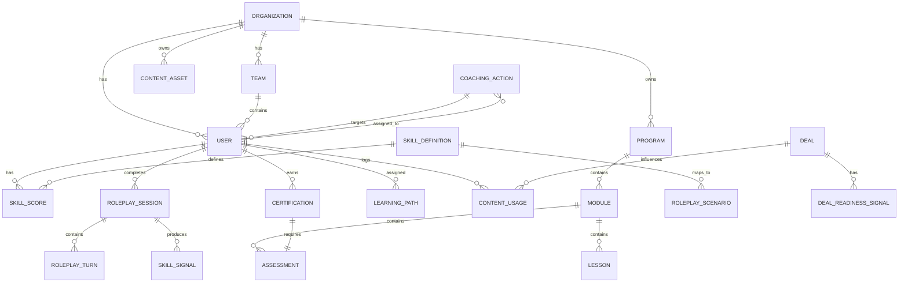

# Data Model

---

## Core Entities

---

## Entity Definitions

### Organization
| Field | Type | Notes |
|-------|------|-------|
| `id` | UUID | Primary key |
| `name` | String | Company/organization name |
| `slug` | String | URL-safe identifier |
| `plan_tier` | Enum | readiness / enablement / revenue |
| `config` | JSONB | Tenant-specific settings |
| `data_residency_region` | Enum | us / eu / apac |
| `created_at` | Timestamp | |
| `sso_config` | JSONB | SAML/OIDC config |

---

### User
| Field | Type | Notes |
|-------|------|-------|
| `id` | UUID | Primary key |
| `org_id` | UUID | Foreign key → Organization |
| `team_id` | UUID | Foreign key → Team |
| `email` | String | Unique per org |
| `name` | String | |
| `role` | Enum | admin / enablement_admin / manager / ae / sdr / pmm / revops / executive |
| `hire_date` | Date | Used for ramp time calculation |
| `manager_id` | UUID | Self-referential → User |
| `created_at` | Timestamp | |
| `last_active_at` | Timestamp | |

---

### Team
| Field | Type | Notes |
|-------|------|-------|
| `id` | UUID | |
| `org_id` | UUID | |
| `name` | String | e.g., "Enterprise AE Team West" |
| `segment` | Enum | enterprise / mid_market / smb / sdr |
| `manager_id` | UUID | Foreign key → User |

---

### Skill Definition
| Field | Type | Notes |
|-------|------|-------|
| `id` | UUID | |
| `org_id` | UUID | Org-specific definitions allowed |
| `name` | String | e.g., "Discovery", "Value Articulation" |
| `category` | Enum | core / advanced / role_specific |
| `weight` | Float | Used in readiness score formula |
| `description` | Text | Used in AI scoring prompts |
| `rubric` | JSONB | Level 1–5 scoring rubric |

---

### Skill Score
| Field | Type | Notes |
|-------|------|-------|
| `id` | UUID | |
| `user_id` | UUID | |
| `skill_id` | UUID | Foreign key → Skill Definition |
| `score` | Integer | 0–100 |
| `confidence` | Float | AI confidence in this score |
| `signal_count` | Integer | Number of signals contributing to score |
| `last_signal_at` | Timestamp | Most recent signal that affected this score |
| `recency_decay_factor` | Float | Applied to signals older than 30 days |
| `updated_at` | Timestamp | |

---

### Roleplay Session
| Field | Type | Notes |
|-------|------|-------|
| `id` | UUID | |
| `user_id` | UUID | |
| `scenario_id` | UUID | Foreign key → Roleplay Scenario |
| `status` | Enum | in_progress / completed / abandoned |
| `overall_score` | Integer | 0–100 |
| `skill_scores` | JSONB | Per-skill scores for this session |
| `debrief_generated` | Boolean | |
| `debrief_content` | Text | AI-generated debrief (encrypted) |
| `ai_confidence` | Float | |
| `manager_feedback` | Integer | 1–5 rating from manager |
| `created_at` | Timestamp | |
| `completed_at` | Timestamp | |

---

### Roleplay Scenario
| Field | Type | Notes |
|-------|------|-------|
| `id` | UUID | |
| `org_id` | UUID | |
| `title` | String | |
| `description` | Text | |
| `buyer_persona` | JSONB | Role, company, context, pain points |
| `difficulty_level` | Enum | beginner / intermediate / advanced |
| `skill_ids` | UUID[] | Skills being practiced |
| `scenario_type` | Enum | discovery / demo / objection / pricing / executive |
| `is_active` | Boolean | |

---

### Coaching Action
| Field | Type | Notes |
|-------|------|-------|
| `id` | UUID | |
| `org_id` | UUID | |
| `rep_user_id` | UUID | Rep being coached |
| `manager_user_id` | UUID | Manager assigned this action |
| `skill_id` | UUID | Skill to be coached |
| `priority` | Enum | critical / high / medium / low |
| `status` | Enum | open / in_progress / completed / dismissed |
| `ai_recommendation` | Text | AI-generated recommendation |
| `evidence_refs` | JSONB | References to supporting signals |
| `ai_confidence` | Float | |
| `manager_override` | Boolean | Did manager override AI recommendation? |
| `override_reason` | Text | If overridden |
| `manager_notes` | Text | Manager's coaching notes |
| `completed_at` | Timestamp | |
| `created_at` | Timestamp | |

---

### Program
| Field | Type | Notes |
|-------|------|-------|
| `id` | UUID | |
| `org_id` | UUID | |
| `title` | String | |
| `type` | Enum | onboarding / product_launch / competitive / skill_development / manager |
| `target_roles` | Enum[] | Which roles this program is for |
| `is_mandatory` | Boolean | |
| `created_by` | UUID | |
| `version` | Integer | |
| `published_at` | Timestamp | |

---

### Certification
| Field | Type | Notes |
|-------|------|-------|
| `id` | UUID | |
| `user_id` | UUID | |
| `org_id` | UUID | |
| `certification_type` | String | e.g., "Core Discovery Certification" |
| `status` | Enum | not_started / in_progress / passed / failed / expired |
| `score` | Integer | Assessment score (0–100) |
| `pass_threshold` | Integer | Required score |
| `issued_at` | Timestamp | |
| `expires_at` | Timestamp | Null if no expiry |
| `assessment_id` | UUID | |

---

### Content Asset
| Field | Type | Notes |
|-------|------|-------|
| `id` | UUID | |
| `org_id` | UUID | |
| `title` | String | |
| `type` | Enum | battle_card / case_study / pitch_deck / one_pager / faq / video / playbook |
| `url` | String | Link to asset storage |
| `version` | Integer | |
| `freshness_score` | Integer | 0–100; decays over time |
| `tags` | String[] | Topics, use cases, personas |
| `embedding_id` | String | Reference to vector DB embedding |
| `created_at` | Timestamp | |
| `updated_at` | Timestamp | |
| `created_by` | UUID | |

---

### Deal
| Field | Type | Notes |
|-------|------|-------|
| `id` | UUID | |
| `org_id` | UUID | |
| `crm_deal_id` | String | External CRM record ID |
| `owner_user_id` | UUID | AE who owns this deal |
| `account_name` | String | |
| `stage` | String | Synced from CRM |
| `value` | Integer | In USD cents |
| `close_date` | Date | Expected close |
| `deal_readiness_score` | Integer | 0–100 |
| `risk_signals` | JSONB | AI-detected risk signals |
| `last_synced_at` | Timestamp | |

---

### Deal Readiness Signal
| Field | Type | Notes |
|-------|------|-------|
| `id` | UUID | |
| `deal_id` | UUID | |
| `signal_type` | Enum | skill_gap / missing_content / no_exec_sponsor / competitor_mentioned / stalled |
| `description` | Text | AI-generated explanation |
| `severity` | Enum | critical / warning / info |
| `suggested_action` | Text | |
| `resolved` | Boolean | |
| `created_at` | Timestamp | |
